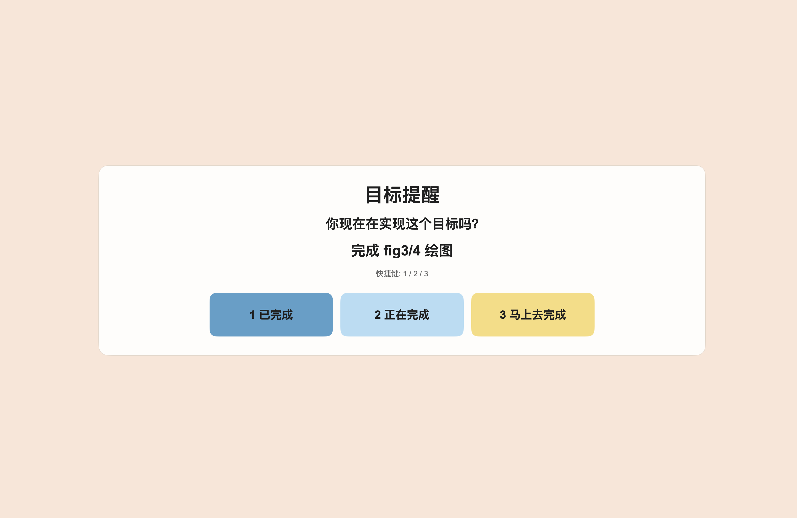
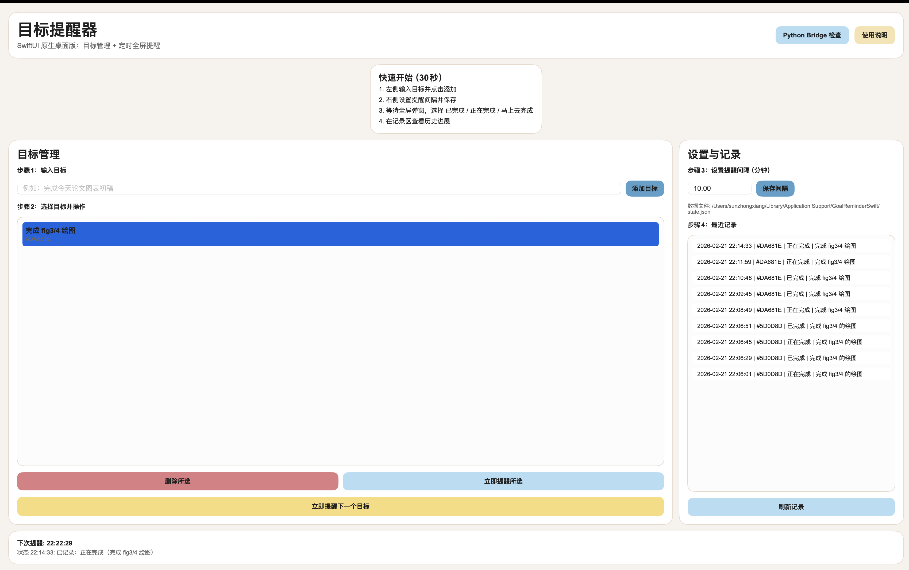

# 目标提醒器 GoalReminderSwift

一个为「多进程忙一天，但晚上回看又觉得自己没真正推进核心目标」的人做的 macOS 提醒工具。

## 创建初衷

我做这个 App 的原因很直接：

当你同时开很多任务（消息、会议、临时问题、上下文切换）时，很容易在“看起来一直很忙”里消耗掉整天，却没在最重要目标上持续前进。

`GoalReminderSwift` 通过“周期性全屏追问”把你拉回主线：

- 你现在是否在推进目标？
- `已完成 / 正在完成 / 马上去完成`

核心目的不是制造压力，而是降低“忙碌幻觉”，让注意力不断回到真正重要的事上。

## 技术栈

- Language: `Swift`
- UI: `SwiftUI` + `AppKit`（全屏提醒窗口）
- IDE: `Xcode`
- ML: `Core ML`（已预留接口）
- Python bridge: `Process` 调用本机 `python3`（已预留接口）
- Tools: `Git`, `Homebrew`

## 使用界面截图

### 主界面



### 全屏提醒弹窗



## 功能

- 目标新增 / 删除 / 选择
- 提醒间隔设置（分钟）
- 定时全屏提醒弹窗（`1 已完成` / `2 正在完成` / `3 马上去完成`）
- 已有未处理弹窗时，后续提醒自动跳过（不重复叠弹）
- 历史记录追踪
- 本地持久化存储

## 使用方案（推荐）

1. 每天开始工作前，先添加 1~3 个当天最重要目标。
2. 提醒间隔建议设置为 `10~30` 分钟（新习惯可先 10 分钟）。
3. 弹窗出现时，必须立刻做出一个选择，不跳过。
4. 每天结束前看“最近记录”：
   你会清楚看到自己是持续推进，还是频繁偏离。

## 快速开始

### 直接使用打包版本（推荐）

仓库已包含打包文件：

- `release/GoalReminderSwift.app.zip`

使用方式：

1. 下载并解压 `GoalReminderSwift.app.zip`
2. 双击 `GoalReminderSwift.app`
3. 如果首次被系统拦截，右键应用选择“打开”

注意：

- 不要直接点 `Contents/MacOS/GoalReminderApp`
- 当前打包版本主要面向 Apple Silicon（M 系列）

### 本地源码运行

```bash
cd /Users/sunzhongxiang/Desktop/科研/development_tools/target_remainder/GoalReminderSwift
swift build
swift run GoalReminderApp
```

### 在 Xcode 中运行

1. 打开 Xcode
2. `File -> Open...`
3. 选择本目录 `GoalReminderSwift`
4. 运行 `GoalReminderApp` target

## 工程结构

- `Package.swift`: Swift Package 配置
- `Sources/GoalReminderApp/App`: 应用入口
- `Sources/GoalReminderApp/ViewModels`: 状态管理与调度逻辑
- `Sources/GoalReminderApp/Views`: SwiftUI 主界面与提醒视图
- `Sources/GoalReminderApp/Data`: 本地数据存储
- `Sources/GoalReminderApp/Services`: Core ML / Python bridge / 全屏弹窗管理
- `assets/screenshots`: README 使用截图
- `release`: 打包好的可执行 App 压缩包

## Core ML 与 Python bridge

- Core ML 接口文件：`Sources/GoalReminderApp/Services/GoalInsightEngine.swift`
- Python bridge 文件：`Sources/GoalReminderApp/Services/PythonBridgeService.swift`

当前为稳定占位实现，后续可以接入你自己的模型和 Python 脚本。

## 数据文件位置

运行后数据保存在：

- `~/Library/Application Support/GoalReminderSwift/state.json`
